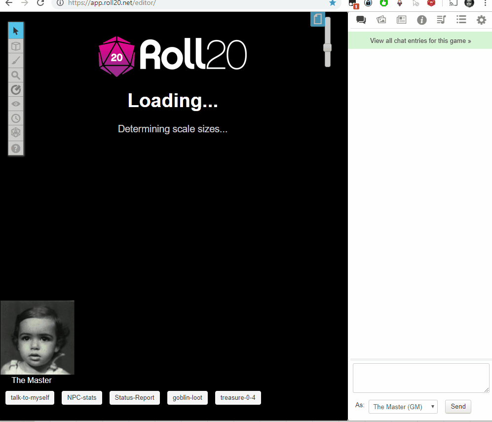

This extension allows you to export a Roll 20 campaign and all of its assets into a ZIP file for backup/archiving purposes.

## **Note: Today (January 6th 2022), Roll 20 has updated their settings interface which prevents the exporter from adding its button to its interface. I will be updating the extension soon to fix that. In the meantime, press F12 in Chrome to open the devtools console, and type in it : `exporter.exportCampaignZip()` to start the export process manually.**

> **DISCLAIMER**: 
> The use of this tool is meant for backup and archiving purposes of your own campaigns. It is only meant and should only be used on campaigns with content that you own.  
> Even if using it only on your own previously uploaded content, the use of this tool may still be against the [Roll 20 Marketplace Asset End User License Agreement](https://wiki.roll20.net/Marketplace_Asset_EULA)
> and the [Roll 20 EULA or Terms of Service](https://wiki.roll20.net/Terms_of_Service_and_Privacy_Policy).  
> The use of this extension may be considered grounds for account suspension or termination. Use at your own risks.

# R20Exporter

This extension is only available for Chrome, as it uses the local storage API to store the ZIP file, which can have many GBs of data in it. Firefox unfortunately does not support that API, so it cannot work for it.

**To install,** please visit the [Chrome Webstore](https://chrome.google.com/webstore/detail/r20exporter/apbhfinbjilbkljgcnjjagecnciphnoi)

To export your campaign go to the settings tab in the Roll20 page (the gear icon on the far right of the sidebar) and at the top you should see a button "**Export Campaign to ZIP**". Simply click on it, then wait until the ZIP file is generated and downloaded.

While generating the ZIP file, do make sure you have the campaign tab focused in chrome (separate it in its own window if needed), otherwise the download speed of the zip will drop to very very slow transfer speeds since the javascript that generates the zip on the fly will be running as a low priority background process.

The dialog that opens will show you the various steps the script is undertaking and you can click the Log button to see a more detailed log of what is happening. That dialog window will also prevent you from messing around with the campaign. It is best to let the script do its thing unhindered and to not open another campaign in another window. Once the export process is complete, that window will close on its own and the ZIP file will be downloaded automatically.

To report any issues, please go to the GitHub [issue tracker](https://github.com/kakaroto/R20Exporter/issues).

# Demo

Here's a little demo to show you how it works (note that this may not reflect the latest version of the tool) :

# License

This extension was written by [Youness Alaoui](https://github.com/kakaroto) and is licensed under the LGPL open source license.

See [LICENSE.LGPL.md](LICENSE.LGPL.md) for more information.

The icon for the extension is built using icons made by Delapouite from [GameIcons.net](https://game-icons.net/)

# Further work

This tool was initially released as a patrons only perk on my [Patreon](https://patreon.com/kakaroto) and now that it is no longer in beta, it's been made available to everyone.

These are other tools that I am working on and that might be useful to other D&D players.

* [Beyond20](https://beyond20.here-for-more.info) : A Browser extension to integrate D&D Beyond character sheets into Roll 20 or Foundry VTT
* [R20Converter](https://patreon.com/kakaroto) : A script to convert a Roll20 campaign (exporter with this tool) into a pre-configured world for Foundry VTT (Patreon only)
* [FVTT Modules](https://github.com/kakaroto?utf8=%E2%9C%93&tab=repositories&q=fvtt-module&type=&language=) : Various modules for Foundry VTT that improve Quality of Life or add some familiar features that Roll 20 had for those who don't like changing their habits.

If you'd like to support me in the work I'm doing, you can subscribe to my [Patreon](https://patreon.com/kakaroto) or use my [Paypal](https://www.paypal.me/KaKaRoTo) for a one-time contribution.

Thanks!
